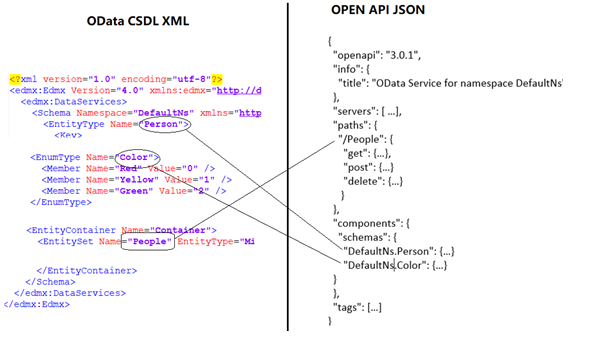

[](https://www.nuget.org/packages/Microsoft.OpenApi.OData/)

# Convert OData to OpenAPI.NET

## Introduction

The **Microsoft.OpenAPI.OData.Reader** library helps represent an OData service metadata as an OpenApi description. It converts [OData](http://www.odata.org) [CSDL](http://docs.oasis-open.org/odata/odata-csdl-xml/v4.01/odata-csdl-xml-v4.01.html), the XML representation of the Entity Data Model (EDM) describing an OData service into [Open API](https://github.com/OAI/OpenAPI-Specification) based on [OpenAPI.NET](http://aka.ms/openapi) object model.

The conversion is based on the mapping doc from [OASIS OData OpenAPI v1.0](https://www.oasis-open.org/committees/document.php?document_id=61852&wg_abbrev=odata) and uses the following :

1. [Capabilities vocabulary annotation](https://github.com/oasis-tcs/odata-vocabularies/blob/main/vocabularies/Org.OData.Capabilities.V1.xml)
2. [Authorization vocabulary annotation](https://github.com/oasis-tcs/odata-vocabularies/blob/main/vocabularies/Org.OData.Authorization.V1.xml)
3. [Core vocabulary annotation](https://github.com/oasis-tcs/odata-vocabularies/blob/main/vocabularies/Org.OData.Core.V1.xml)
4. Navigation property path
5. Edm operation and operation import path

## Overview

The image below is generic overview of how this library can convert the EDM model to an [OpenAPI.NET document](https://github.com/Microsoft/OpenAPI.NET/blob/main/src/Microsoft.OpenApi/Models/OpenApiDocument.cs) object.



For more information on the CSDL and Entity Data model, please refer to [http://www.odata.org/documentation](http://www.odata.org/documentation).
For more information about the Open API object of model, please refer to [http://github.com/microsoft/OpenAPI.NET](http://github.com/microsoft/OpenAPI.NET)

## Sample code

The following sample code illustrates the use of the library

```csharp
public static void GenerateOpenApiDescription()
{
    IEdmModel model = GetEdmModel();
    OpenApiDocument document = model.ConvertToOpenApi();
    var outputJSON = document.SerializeAsJson(OpenApiSpecVersion.OpenApi3_0);
    var outputYAML = document.SerializeAsYaml(OpenApiSpecVersion.OpenApi3_0);
}

public static IEdmModel GetEdmModel()
{
    // load EDM model here...
}
```

Or with the convert settings:

```csharp
public static void GenerateOpenApiDescription()
{
    IEdmModel model = GetEdmModel();
    OpenApiConvertSettings settings = new OpenApiConvertSettings
    {
        // configuration
    };
    OpenApiDocument document = model.ConvertToOpenApi(settings);
    var outputJSON = document.SerializeAsJson(OpenApiSpecVersion.OpenApi3_0);
    var outputYAML = document.SerializeAsYaml(OpenApiSpecVersion.OpenApi3_0);
}

public static IEdmModel GetEdmModel()
{
    // load EDM model here...
}
```

The `GetEdmModel()` method can load a model in 3 ways:

1. Create the Edm model from scratch. For details refer [building a basic model](http://odata.github.io/odata.net/#02-01-build-basic-model)

2. Load the Edm model from CSDL file. The following shows a code sample that loads a model from a csdl file.

    ```csharp
    public static IEdmModel GetEdmModel()
    {
        string csdlFilePath = @"c:\csdl.xml";
        string csdl = System.IO.File.ReadAllText(csdlFilePath);
        IEdmModel model = CsdlReader.Parse(XElement.Parse(csdl).CreateReader());
        return model;
    }
    ```

3. Create the Edm model using Web API OData model builder. For details refer to the [web api model builder article](http://odata.github.io/WebApi/#02-01-model-builder-abstract)


## Nuget packages

The OpenAPI.OData.reader nuget package is at: [https://www.nuget.org/packages/Microsoft.OpenApi.OData/](https://www.nuget.org/packages/Microsoft.OpenApi.OData)

---

# Contributing

This project welcomes contributions and suggestions.  Most contributions require you to agree to a
Contributor License Agreement (CLA) declaring that you have the right to, and actually do, grant us
the rights to use your contribution. For details, visit [https://cla.microsoft.com](https://cla.microsoft.com).

When you submit a pull request, a CLA-bot will automatically determine whether you need to provide
a CLA and decorate the PR appropriately (e.g., label, comment). Simply follow the instructions
provided by the bot. You will only need to do this once across all repos using our CLA.

You can also open an issue directly on this repo via this [link](https://github.com/microsoft/OpenAPI.NET.OData/issues/new?assignees=&labels=&projects=&template=bug_report.md).

This project has adopted the [Microsoft Open Source Code of Conduct](https://opensource.microsoft.com/codeofconduct/).
For more information see the [Code of Conduct FAQ](https://opensource.microsoft.com/codeofconduct/faq/) or
contact [opencode@microsoft.com](mailto:opencode@microsoft.com) with any additional questions or comments.
